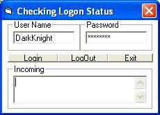



## Neopets Inet Example

### Description

This example shows you how to login/logout into http://www.neopets.com using inet. It also checks to see if the account is frozen or not. It uses inet to put the source code of the url it open into a textbox, then searches for the strings that would be in there if you were to login/logout/have a frozen account. This example is fully commented so it is easy to understand what everything does. (note: it also tells you if your IP has been banned from trying to login the chosen account too many time [your IP is only banned on the one account temporarily.])

lol dont know if that made much sense...:D
 
### More Info
 
If your thinking of making a neopets cracker (which I am not encouraging), you should know that the site only lets your IP have 10 or so login attempts per username every. You will need to use proxys if you wish to. (I DONT RECOMMEND MAKING ONE)

             |
---                |---
**Submitted On**   |2002-11-28 19:19:16
**By**             |[DarkKnightH20](https://github.com/Planet-Source-Code/PSCIndex/blob/master/ByAuthor/darkknighth20.md)
**Level**          |Beginner
**User Rating**    |5.0 (10 globes from 2 users)
**Compatibility**  |VB 6\.0
**Category**       |[Miscellaneous](https://github.com/Planet-Source-Code/PSCIndex/blob/master/ByCategory/miscellaneous__1-1.md)
**World**          |[Visual Basic](https://github.com/Planet-Source-Code/PSCIndex/blob/master/ByWorld/visual-basic.md)
**Archive File**   |[Neopet\_Ine15048711282002\.zip](https://github.com/Planet-Source-Code/darkknighth20-neopets-inet-example__1-41117/archive/master.zip)

